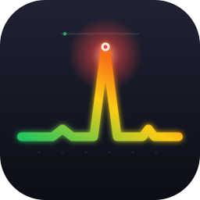

<p align="center">
  
</p>

<h1 align="center">surgebar</h1>

<p align="center">
  <a href="LICENSE"></a>
  <a href="https://www.python.org/downloads/"></a>
  
  <a href="https://github.com/talvinder/surgebar/actions/workflows/ci.yml"></a>
</p>

> Menu bar CPU surge alerts with one-click LLM-powered triage.

surgebar lives in your macOS menu bar. It watches your CPU and load average, fires a notification when things go sideways, and asks an LLM (Claude, GPT-5, a local Llama via Ollama, whatever you prefer) what to do about it — then lets you throttle, quit, or kill the culprit with one click.

**Bring your own model.** surgebar speaks two protocols: Anthropic Messages and OpenAI Chat Completions. That covers Claude, GPT, Groq, OpenRouter, Together, Mistral, Fireworks, Ollama, LM Studio, vLLM, LiteLLM, and most other LLM endpoints in production.

```
🟢 12%  L:1.2    ← all good
🟡 67%  L:3.4    ← warning
🔴 91%  L:8.1    ← notification fires, Claude triages
```

## Why I built this

I work on an M3 Pro with 18GB of RAM — not exactly a slow machine. But the moment I'd open a few Claude Code sessions, spawn some subagents, and start vibe-coding across two or three projects, the fans would spin up and the whole machine would start choking. Every time.

The frustrating part was figuring out *what* was choking it. The culprit was almost never the LLM session itself. It was a stray `node` process from a dev server I'd forgotten to kill, or an MCP server stuck in a loop, or a Vite watcher fighting another Vite watcher. Activity Monitor showed me a 400% CPU process called `node` with PID 81243 and a 200-char cmdline I couldn't parse at a glance.

What I actually did, every time: I'd ask the Claude session itself — "find the process eating my CPU, tell me what it is, kill it." Claude would run `ps`, summarize, recommend, I'd hit yes.

surgebar is just that loop, automated. It watches your CPU, notices the surge before the fans do, sends the top processes to an LLM, gets back a triage plan, and lets you act in one click. Activity Monitor shows you what's hot. surgebar tells you what to do about it.

## Features

- **Surge detection.** Polls every 5s. Notifies on ≥85% CPU or load-per-core ≥2.0.
- **AI triage.** Sends top processes + system signals to Claude, gets back 1–3 ranked actions (throttle / quit / kill / info) with rationales.
- **One-click execution.** `renice 19` for throttle, `SIGTERM` for quit, `SIGKILL` for kill. Every destructive action confirms first.
- **Top-process kill list.** Six hottest processes always in the menu. Click any one to kill it.
- **Protected processes.** Hard-coded refusal to touch `kernel_task`, `WindowServer`, `Finder`, etc. — no matter what Claude recommends.
- **Degraded mode.** Works without an API key — you get surge alerts and the kill list, just no AI suggestions.

## Install

```bash
pipx install surgebar
```

Don't have `pipx`? `brew install pipx && pipx ensurepath`.

## First-run setup

```bash
surgebar configure
```

Picks your provider (Anthropic or OpenAI-compatible), takes your API key, sets the model and base URL. Or skip the CLI — every option is in the menu bar's **Configuration** submenu.

### Provider options

| Provider | Protocol | Base URL | Get a key |
|---|---|---|---|
| Anthropic | Anthropic Messages | `https://api.anthropic.com` | https://console.anthropic.com/settings/keys |
| OpenAI | OpenAI Chat | `https://api.openai.com` | https://platform.openai.com/api-keys |
| Groq | OpenAI Chat | `https://api.groq.com/openai` | https://console.groq.com/keys |
| OpenRouter | OpenAI Chat | `https://openrouter.ai/api` | https://openrouter.ai/keys |
| Together | OpenAI Chat | `https://api.together.xyz` | https://api.together.xyz/settings/api-keys |
| Mistral | OpenAI Chat | `https://api.mistral.ai` | https://console.mistral.ai/api-keys/ |
| Ollama (local) | OpenAI Chat | `http://localhost:11434` | n/a — set any key, e.g. `ollama` |
| LM Studio (local) | OpenAI Chat | `http://localhost:1234` | n/a |
| Azure-hosted Anthropic | Anthropic Messages | your Azure URL ending in `/anthropic` | from your Azure portal |

Set the base URL via **Configuration → Set base URL…**. Set the model via **Configuration → Model**, including a "Enter custom model…" option for arbitrary identifiers (e.g. `qwen2.5-coder:7b`, `anthropic/claude-haiku-4.5`, `mistral-large-latest`).

### Where things are stored

| What | Where | Why |
|---|---|---|
| API key (per provider) | macOS Keychain, service `surgebar:<provider>-api-key` | secure, survives reinstalls |
| Provider, model, base URL | `~/Library/Application Support/Surgebar/config.json` | non-sensitive |

## Run

```bash
surgebar
```

You'll see a 🟢 emoji and live CPU% in your menu bar. To run it on login, see [Auto-start on login](#auto-start-on-login) below.

## Configuration cheat sheet

| Setting | How to change |
|---------|---------------|
| Provider | Configuration → Provider → pick one |
| API key (for selected provider) | Configuration → Set API key… or `surgebar configure` |
| Base URL | Configuration → Set base URL… |
| Model | Configuration → Model → pick preset or "Enter custom model…" |
| Thresholds (CPU_WARN/CRIT, poll interval) | code constants in `src/surgebar/app.py` |

Environment-variable fallbacks (used when Keychain is empty): `ANTHROPIC_API_KEY`, `OPENAI_API_KEY`.

## CLI

```
surgebar              Run the menu bar app
surgebar configure    Save your Anthropic API key + pick a model
surgebar status       Show current configuration
surgebar --version    Print version
```

## Auto-start on login

surgebar ships a launchd plist template at `scripts/com.surgebar.app.plist`. To install:

```bash
SURGEBAR_BIN=$(which surgebar)
sed "s|__SURGEBAR_BIN__|$SURGEBAR_BIN|" scripts/com.surgebar.app.plist \
  > ~/Library/LaunchAgents/com.surgebar.app.plist
launchctl load ~/Library/LaunchAgents/com.surgebar.app.plist
```

To remove:
```bash
launchctl unload ~/Library/LaunchAgents/com.surgebar.app.plist
rm ~/Library/LaunchAgents/com.surgebar.app.plist
```

## How the AI triage works

When CPU surges, surgebar collects: top 5 processes by CPU (with name, PID, CPU%, mem MB, threads, age, parent, cmdline, and a user-recognizable app_name pulled from each process's `.app` bundle), plus system load, swap %, memory %. It sends that snapshot to your configured LLM with a prompt that says: "return JSON array of 1–3 actions, never recommend killing protected processes, prefer throttle > quit > kill, suggest 'wait' for known transient indexers."

The LLM's response is then **sanitized**: any action targeting a protected process or a non-existent PID is dropped. Even if the model goes off-script, surgebar won't `kill -9 WindowServer`.

Each suggested action is a menu item with a kind prefix:
- `↓` throttle (renice 19)
- `⏏` quit (SIGTERM)
- `✕` kill (SIGKILL)
- `ⓘ` info (just an explanation, no button)

Clicking opens a confirmation alert with the rationale before doing anything.

## Security

- API keys live in macOS Keychain (one entry per provider), accessed via the `security` CLI. No plaintext on disk.
- All LLM API calls go directly from your Mac to your configured base URL over TLS. No proxy server. No telemetry.
- For privacy-sensitive setups, point surgebar at a local model: `Configuration → Set base URL → http://localhost:11434` (Ollama) or `http://localhost:1234` (LM Studio). No data leaves your machine.
- surgebar never sends file contents — only process names, PIDs, CPU%, memory MB, thread counts, parent process, the first 200 chars of cmdline, and the matched app's `CFBundleName`.

## Roadmap

- [ ] Notarized `.dmg` for non-Python users (paid tier, ~$5)
- [ ] Configurable thresholds via UI
- [ ] Pause monitoring (e.g., during builds)
- [ ] Per-process history / "what's been surging this week"
- [ ] Optional local LLM backend (Ollama) so AI triage works offline

## Building from source

```bash
git clone https://github.com/talvinder/surgebar
cd surgebar
pip install -e ".[dev]"
python -m surgebar
```

## License

MIT — see [LICENSE](LICENSE).
