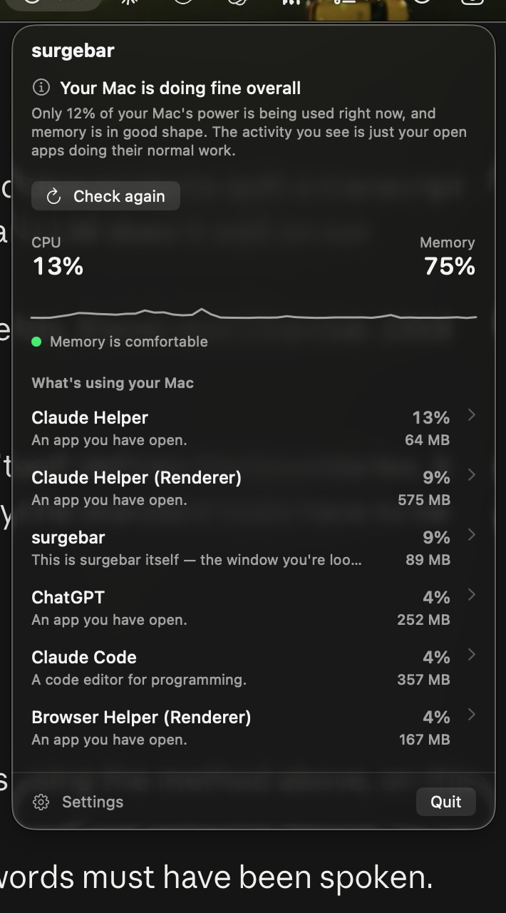

<h1 align="center">surgebar</h1>

<p align="center">
  <a href="LICENSE"></a>
  
  
  
</p>

> A menu bar monitor that tells you, in plain English, what's slowing your Mac down — and lets you fix it in one click.

<p align="center">
  
</p>

surgebar sits in your menu bar showing live CPU. Click it and you get memory pressure, a CPU history sparkline, and the programs actually working your Mac — each described in a sentence a human can read, not a unix command name. Click any one to slow it down, quit it, or force quit it.

Optionally, bring your own AI key and it will read the whole picture and tell you what to do about it.

## Why

I work on an M3 Pro with 18GB of RAM. The moment I'd open a few AI coding sessions, spawn some subagents, and start working across two or three projects, the fans would spin up and the machine would start choking.

The frustrating part was figuring out *what* was choking it. The culprit was almost never the thing I was working in. It was a stray `node` process from a dev server I'd forgotten to kill, or an MCP server stuck in a loop, or a file sync daemon reindexing the world. Activity Monitor showed me a 400% CPU process called `node` with a 200-character command line I couldn't parse at a glance.

What I actually did, every time: ask an AI session to find the process eating my CPU, tell me what it is, and kill it.

surgebar is that loop, made native. Activity Monitor shows you what's hot. surgebar tells you what to do about it.

## Features

- **Plain-English process names.** `corespotlightd` becomes "Part of macOS. Best left running." A stray helper becomes "A helper program running in the background — usually part of an app you're using."
- **One-click actions.** Slow down (renice), quit (SIGTERM), or force quit (SIGKILL). Destructive actions confirm first, and say what will happen in plain words.
- **Protected processes.** It refuses to touch `kernel_task`, `WindowServer`, `Finder`, `launchd` and friends — no matter what the AI suggests. It also refuses to kill itself.
- **Bring your own AI.** Speaks both the Anthropic Messages and OpenAI Chat Completions protocols, so it works with Claude, GPT, Groq, OpenRouter, Together, Mistral, Azure AI Foundry, or a local model via Ollama / LM Studio / vLLM.
- **Your key stays yours.** Stored in the macOS Keychain, never on disk in the clear, and only ever sent to the endpoint you configure. surgebar ships no key of its own.
- **Works fine without AI.** Without a key you still get live CPU and memory, the process list, and every action. The AI is an opt-in layer, not the product.
- **Nearly free at rest.** The always-on sampler reads two cheap system-wide numbers a second. The heavier per-process scan runs only while the panel is open — a resource monitor shouldn't be what's using your resources.
- **Native.** SwiftUI `MenuBarExtra`, SF Symbols, system materials, no Dock icon, no Electron, ~90MB resident.

## Install

Requires macOS 14 or later and Xcode's command line tools.

```bash
git clone https://github.com/talvinder/surgebar.git
cd surgebar
./scripts/build-app.sh
./scripts/install.sh
```

`build-app.sh` compiles and assembles `Surgebar.app`. `install.sh` copies it to `/Applications` and registers a launch agent so it starts at login.

To uninstall:

```bash
launchctl bootout gui/$(id -u)/com.talvinder.surgebar
rm ~/Library/LaunchAgents/com.talvinder.surgebar.plist
rm -r /Applications/Surgebar.app
```

### Turning on AI advice

Open the panel → **Settings**, then set:

| Field | For Claude | For OpenAI-compatible |
|---|---|---|
| Service | Anthropic (Claude) | OpenAI-compatible |
| Endpoint | `https://api.anthropic.com` | `https://api.openai.com` |
| Model | `claude-sonnet-4-6` | `gpt-4o-mini` |
| API key | your key | your key |

Then hit **Test connection**. The Service setting picks the wire protocol, so it has to match the endpoint — the two use different request paths, and a mismatch is the most common setup mistake. surgebar will tell you if it spots one.

Any OpenAI-compatible gateway works in the second column, including a local model (`http://localhost:11434/v1` for Ollama).

## Two things macOS will bite you on

Worth writing down, because both cost real debugging time and neither fails loudly.

**A bare executable cannot own a menu bar item.** On macOS 26, a process without a proper `.app` bundle — a plain binary, a Python script, anything `swift build` alone produces — can create an `NSStatusItem` that never appears. No error, no log line: the app runs happily and draws nothing. This is why `build-app.sh` exists rather than just `swift build`, and why the bundle needs an `Info.plist` with `LSUIElement`.

**A `ScrollView` has no intrinsic height.** `MenuBarExtra` sizes its window from the content's *ideal* height, and an unconstrained `ScrollView` reports zero — so the panel renders as a header and a footer with nothing between them. `.frame(maxHeight:)` doesn't fix it, because a maximum isn't an ideal. Sizing it with `.fixedSize()` appears to fix it but silently disables clipping, so tall content draws over the header and footer instead. The fix that works is to measure the content and give the `ScrollView` a definite frame.

## How it works

| | |
|---|---|
| Menu bar sampler | `host_statistics(HOST_CPU_LOAD_INFO)` for CPU ticks and `host_statistics64(HOST_VM_INFO64)` for memory (active + wired + compressed), once a second |
| Memory pressure | `DispatchSourceMemoryPressure` — the kernel's own warning/critical signal, event-driven rather than inferred from a threshold |
| Process scan | `proc_listpids` + `proc_pidinfo(PROC_PIDTASKINFO)`, sampled twice ~600ms apart; the CPU-time delta becomes a live percentage (mach ticks → nanoseconds via `mach_timebase_info`, so one full core reads as 100%) |
| Naming | `proc_pidpath` → owning `.app` bundle name, with a hand-written table mapping common system daemons to plain descriptions |
| Actions | `setpriority(PRIO_PROCESS, pid, 19)`, `kill(pid, SIGTERM)`, `kill(pid, SIGKILL)` |
| AI | your endpoint, your key, over `URLSession`; the prompt carries system metrics plus the top processes and asks for ranked, actionable advice |

Percentages are per-core, matching Activity Monitor — a process using two full cores reads as 200%.

## A note on the Python version

surgebar started as a Python menu bar app (`pipx install surgebar`), which is what earlier tags of this repository contain. **That version no longer works on macOS 26** — it hits the bare-executable problem described above: it runs, reports itself healthy, and puts nothing in your menu bar.

This native Swift rewrite replaces it. The Python implementation remains in history as the reference for what the behaviour should be.

## License

MIT — see [LICENSE](LICENSE).
